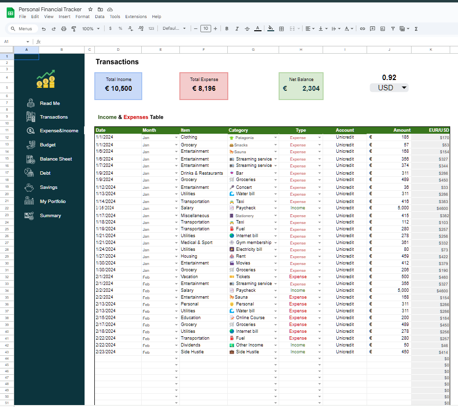
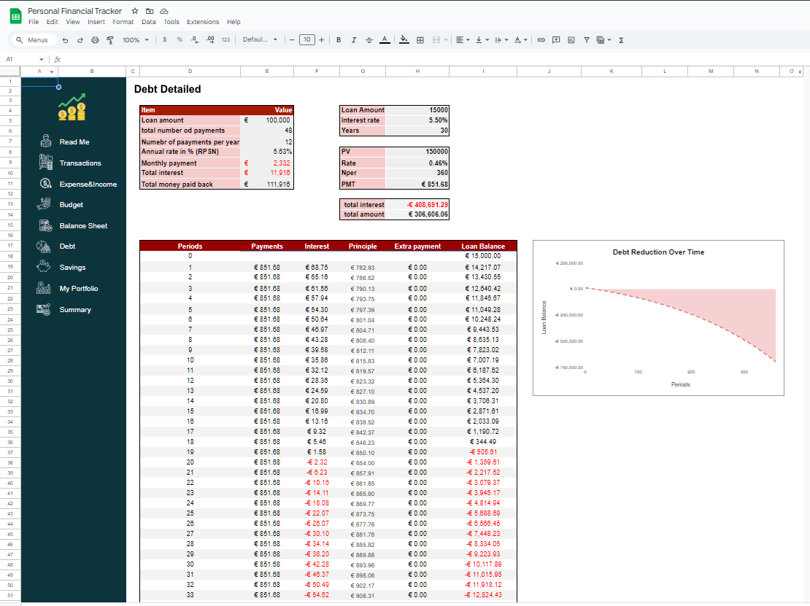

# Automated Personal Finance Tracker – A Google Sheets Solution

  

## Introduction
Managing personal finances effectively can be overwhelming, especially when tracking multiple income sources, expenses, savings, debts, and investments. This project presents a fully automated personal finance tracker built in Google Sheets, designed to provide a comprehensive financial overview at a glance.

With this tracker, users can:
- ✅ Log and categorize transactions effortlessly
- ✅ Monitor income, expenses, and account balances in real-time
- ✅ Track debt repayment and savings goals
- ✅ Manage stock investments
- ✅ View key financial insights through a summary dashboard

The tracker consists of eight interconnected tabs, each serving a specific function. Below is a detailed breakdown of these components, with recommended sections for visual illustrations.

### 1. Read Me (User Guide)

[Watch video](https://drive.google.com/file/d/1EH_-br8BqMeoNY6-JRq7NISNEJd64AQV/view?usp=sharing)

This tab serves as a quick-start guide explaining:
- How to input data into the tracker
- An overview of automated calculations
- Best practices for keeping financial records organized

### 2. Transactions Tab

This is the core data entry tab where users log all financial transactions.
- Date: When the transaction occurred
- Category: Income, Expense, Debt Payment, Savings, or Investment
- Amount: Transaction value
- Payment Method: Cash, Credit Card, Bank Transfer, etc.

_Automation: This tab dynamically feeds data into other sections for real-time financial tracking_.

### 3. Expense and Income Tab

This tab automatically categorizes income and expenses, offering insights into:
- Top spending categories (e.g., Rent, Groceries, Utilities)
- Income breakdown (e.g., Salary, Side Hustles, Investments)
- Net Cash Flow – whether you're spending more than you earn
- 
_Automation: Built-in formulas update totals instantly when new transactions are added._

### 4. Budgeting Tab

The budgeting tab helps users set spending limits for different categories and track actual expenses against them.

- Define budgets for key spending categories (e.g., Housing, Food, Entertainment)
- Track actual spending vs. budgeted amounts
- Color-coded alerts:
- Green = Within budget
- Yellow = Nearing budget
- Red = Over budget

_Automation: Uses conditional formatting to visually indicate spending trends._

### 5. Balance Sheet Tab

The balance sheet provides a snapshot of financial health, summarizing:
- Assets: Cash, Bank Balances, Investments
- Liabilities: Debts, Credit Card Balances, Loans
- Net Worth: Total Assets – Total Liabilities

_Automation: Automatically pulls data from savings, debt, and investment tabs._

### 6. Debt Tracking Tab

Debt tracking is crucial for financial stability. This tab helps users:
- List all outstanding debts (e.g., Credit Cards, Student Loans, Personal Loans)
- Track payments made and outstanding balances
- Set repayment goals and monitor progress

_Automation: Color-coded progress bars indicate repayment completion status._

### 7. Savings Tracker Tab

This tab is designed to help users set and achieve savings goals:
-Categories: Emergency Fund, Travel, Retirement, etc.
Target Amount vs. Current Balance
Deposit Tracking: Automatically logs deposits made from the Transactions tab

_Automation: Uses progress indicators to show how close each goal is to completion._

### 8. My Stock Portfolio Tab

For users investing in stocks, this tab offers:
- Portfolio Overview: List of owned stocks and quantities
- Real-Time Price Updates: Google Finance integration for live market prices
- Profit/Loss Calculation: Automated tracking of gains and losses

_Automation: Uses Google Finance functions to fetch live stock data._

### 9. Summary Dashboard

[Watch video](https://drive.google.com/file/d/1EH_-br8BqMeoNY6-JRq7NISNEJd64AQV/view?usp=sharing)

The summary dashboard presents high-level financial insights at a glance, including:
- Total Income vs. Total Expenses
- Savings and Investment Growth
- Debt Repayment Progress
- Net Worth Trends Over Time

_Automation: Uses charts and pivot tables to visualize financial health._

## Conclusion
This automated Google Sheets finance tracker simplifies personal financial management by eliminating manual calculations and providing real-time insights. Whether tracking day-to-day expenses, managing debts, or growing investments, this tool ensures that users stay informed and in control of their finances.

Ready to take charge of your financial future? Start using this tracker today!

- ✅ Created by: James Isaac
- ✅ Built with: Google sheet
- ✅ Data Source: Financial data

